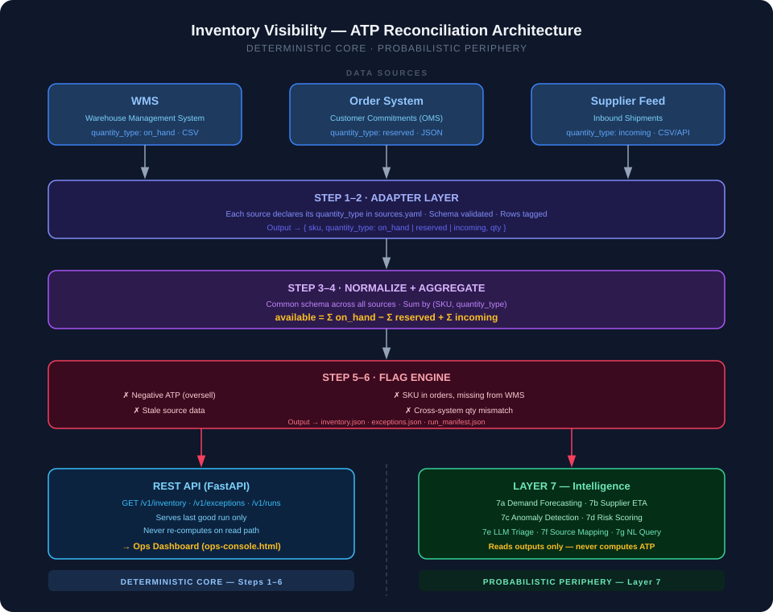

# Inventory Visibility — ATP Reconciliation Engine

<p align="center">
  
</p>

<p align="center">
  <strong>One true "available to sell" number per SKU — computed, auditable, and automatic.</strong><br/>
  <em>Powered by GyaanoraAI · Learn. Explore. Grow with AI.</em>
</p>

---

## The Business Problem

### What breaks without this

Every distribution business runs on three systems that each hold **one piece** of the inventory truth — and none of them agree on what "available" means.

| System | What it knows | The dangerous assumption it makes |
|---|---|---|
| **WMS** (Warehouse) | Units physically on the shelf | Treats allocated stock as sellable |
| **Order System** | Units promised to open orders | Has no idea what's physically there |
| **Supplier Feed** | Inbound shipments in transit | Has no idea what's already been sold |

### The daily damage

> An ops manager opens the WMS, sees **120 units** of SKU-1001, and tells the sales team "we have 120."
>
> But **40 of those 120 are already allocated** to open customer orders. The real sellable quantity is **80**.
>
> Sales sells **100**. Now the business has promised **140 units** of a **120-unit pile**.

That gap — 20 units — triggers:

- **Order cancellations or short-shipments** → customer trust damage
- **Chargebacks** — retail and B2B contracts penalise missed OTIF (On Time In Full) targets. These can run into tens of thousands of dollars per incident.
- **Manual reconciliation** — ops burns an hour every morning VLOOKUPing three files together, and still gets it wrong sometimes.

### The root cause

> This is not a data-volume problem or a technology problem. It is a **semantics problem.**
>
> Three systems each publish a column called `quantity`. The three numbers mean completely different things. Nothing in the business owns the definition of *"available."*

### What "solved" looks like

| Before | After |
|---|---|
| Three spreadsheets, one human, 60 minutes | One run, zero humans, 2 minutes |
| No single "available" definition | One auditable formula per SKU |
| Oversells discovered after the fact | Flagged before the order is confirmed |
| Adding a new source = a dev sprint | Adding a new source = 5 lines of YAML |

---

## What We Are Solving

**Inventory Visibility** owns the single definition of `available` and computes it deterministically from all sources — warehouse, orders, and supplier feeds — on every scheduled run.

```
available = Σ(on_hand)  −  Σ(reserved)  +  Σ(incoming)
```

Every number is traceable back to its source row. Every anomaly is flagged automatically. The operations dashboard always shows the **last good published run** — never a stale spreadsheet, never an inflated WMS number.

### Real numbers from a live run

| Metric | Value |
|---|---|
| SKUs evaluated | 257 |
| WMS naive view (what ops sees today) | 309,308 units |
| True ATP (what is actually sellable) | **209,160 units** |
| Overstatement caught | **100,148 units — 32.4%** |
| Revenue at risk flagged | **$109,484** |
| Critical exceptions auto-detected | 27 |

---

## Architecture



### How it works — step by step

```
Sources (WMS · Orders · Suppliers)
        │
        ▼
[STEP 1-2] Adapter Layer
  · Each source declares its quantity_type in sources.yaml
  · Schema validated, rows tagged: on_hand | reserved | incoming
        │
        ▼
[STEP 3-4] Normalize + Aggregate
  · Common schema across all sources
  · Sum by (SKU, quantity_type)
  · available = Σ on_hand − Σ reserved + Σ incoming
        │
        ▼
[STEP 5-6] Flag Engine
  · Negative ATP (oversell)          · SKU in orders, missing from WMS
  · Stale source data                · Cross-system qty mismatch
        │
        ├──────────────────────────┐
        ▼                          ▼
  REST API (FastAPI)          Layer 7 — Intelligence
  Ops Dashboard               Forecasting · Anomaly · LLM triage
```

### Design principle

> **Deterministic core. Probabilistic periphery.**

Steps 1–6 are fully deterministic — same inputs always produce the same `available` number, with full audit trail in `run_manifest.json`. The LLM/forecasting layer (Layer 7) reads engine outputs only — it **never computes the ATP number.**

This is the key architectural decision. The available number must be:
- **Auditable** — ops can reconstruct the arithmetic from source files
- **Idempotent** — same inputs → same number, every time
- **Defensible** — this is the number that justifies declining a $200k order

---

## Demo

> 📹 **[Watch the full walkthrough video](Inventory_Visibility-availability-platform/doc/Inventory_Visibility.mp4)**

---

## How the Dashboard Works

The ops console (`ops-console.html`) has two navigation groups — **Operations** for daily use and **Engine** for configuration and audit.

```
Operations          │  Engine
────────────────    │  ──────────────────────
Command centre      │  Availability formula
Exception queue     │  Feeds & extensibility
Inventory explorer  │  Data quality & run manifest
                    │  Forecast & risk
                    │  AI layer
                    │  API & CLI · Architecture
```

---

### 1 — Command Centre

> **Replaces the morning spreadsheet.** Shows the true ATP number, the gap vs what ops was reading, and the money at risk — all from a single run.

**The six KPI cards:**

| Card | Live value | What it means |
|---|---|---|
| True available today | **209,160 units** | What sales can safely promise right now |
| Availability overstated by | **100,148 units (32.4%)** | How wrong the old WMS-only method was |
| Revenue at risk | **$109,484** | Money attached to promises that cannot be kept |
| Orders exposed to penalties | **25** | Open orders on oversold products with an OTIF clause |
| Open exceptions | **27 critical / 21 warning** | Problems to action this morning |
| Manual reconciliation time | **0 min** | Was ~60 min/day of spreadsheet work |

**The reconciliation ladder** — the most persuasive object on the screen:

```
What ops read from the WMS export            309,308
   less units already reserved by orders    −  83,190
   less inbound stock not yet arrived       −  16,173
   less damaged, blocked & safety stock     −     785
──────────────────────────────────────────────────────
Available to sell today                      209,160
```

> Start at the top — that's what they were reading. Every line below it is a reason that number was a lie. The bottom line is the only one you can safely sell against.

---

### 2 — Exception Queue

> **The morning worklist.** Every anomaly the engine found, sorted by severity, each with the arithmetic and a suggested action.

**Flag types caught automatically:**

| Flag | Count | Plain English |
|---|---|---|
| `OVERSOLD` | 22 | Promised more than held — revenue at risk today |
| `NEGATIVE_ON_HAND` | 2 | Warehouse reports physically impossible stock |
| `ORPHAN_SKU_IN_ORDERS` | 2 | Selling a product the warehouse has never heard of |
| `LOCATION_OVERSOLD` | 8 | One warehouse short while another has spare — move, don't cancel |
| `OVERDUE_INBOUND` | 5 | Delivery late and quietly inflating the future number |
| `BELOW_SAFETY_STOCK` | 3 | Buffer eaten into — reorder signal |
| `UOM_UNKNOWN` | 1 | Product arrived in a unit with no conversion rule |
| `DUPLICATE_RECORD` | 1 | Same row appeared twice in an export — dropped |
| `BAD_INPUT_ROW` | 1 | Text where a number should be — quarantined |

Click any row → a panel slides out showing the **exact arithmetic**, the **source order IDs**, and which orders carry penalty clauses. No one has to take the number on trust.

---

### 3 — Inventory Explorer

> **The searchable catalogue.** Every SKU, its true ATP number, and one click to the full lineage behind it.

- Filter by status: oversold · location short · negative · orphan · below safety stock
- Sort by available, ATP 7-day, on-hand, or revenue at risk
- Export to CSV for procurement or sales teams
- Click any SKU to see the full `on_hand − reserved + incoming` breakdown with source row evidence

---

### 4 — Engine Tabs (for configuration & audit)

| Tab | What it does |
|---|---|
| **Availability formula** | Live sandbox — change the formula, see the impact on ATP before publishing |
| **Feeds & extensibility** | Add / remove source systems via YAML — no code change needed |
| **Data quality** | Quarantine log, normalisation before/after, row-level audit trail |
| **Forecast & risk** | 7-day ATP projection, SKU risk ranking, supplier ETA predictions |
| **AI layer** | LLM exception triage briefs, natural language inventory queries |
| **API & CLI** | Live endpoint explorer, CLI command reference |

---

### Core Engine

| Layer | Technology | Status | Why |
|---|---|---|---|
| **Language** | Python 3.10+ | ✅ Live | Standard in data/supply-chain tooling; stdlib handles most of the engine |
| **API** | FastAPI + Uvicorn | ✅ Live | Async, auto-generates OpenAPI docs, minimal overhead |
| **Data formats** | CSV · JSON · YAML | ✅ Live | Matches real WMS and OMS export formats; no DB dependency |
| **Config** | PyYAML (`sources.yaml`) | ✅ Live | Declarative source registration — ops adds a source without touching code |
| **Frontend** | Vanilla HTML + CSS + JS | ✅ Live | Zero build step; opens directly in browser; no framework dependency |
| **Testing** | pytest | ✅ Live | Unit tests for engine, pipeline, and intelligence modules |
| **Storage** | Flat files (`runs/latest/`) | ✅ Live | Every run is a self-contained JSON snapshot — portable, auditable, git-diffable |

### Intelligence Layer (Layer 7)

| Module | Technology | Status | What it does today |
|---|---|---|---|
| **Forecasting** | Python `statistics` stdlib | ✅ Live | Classical linear regression + exponential smoothing — backtestable, no black box |
| **Anomaly detection** | Conservation identity math | ✅ Live | Deterministic inventory identity check — auditable, not ML |
| **Risk scoring** | Rule-based weighted scoring | ✅ Live | Ranks SKUs by oversell / stockout probability |
| **Supplier ETA** | Historical lead-time averages | ✅ Live | Predicts inbound arrival from past supplier patterns |
| **LLM layer** | Pluggable — OpenAI / Anthropic Claude | ✅ Live | Exception triage briefs + natural language inventory queries |

### Why no database?

The engine intentionally avoids a database. Each reconciliation run produces a self-contained snapshot in `runs/latest/`. This means:
- Any run can be replayed from its source files
- The audit trail is plain JSON — no SQL needed to inspect it
- The ops dashboard reads a file, not a query — fast and stable under load

---

## Future Stack — Roadmap

These are the planned enhancements as the platform scales from a single-tenant engine to a production-grade multi-tenant SaaS.

### Infrastructure & Storage

| Enhancement | Technology | Why |
|---|---|---|
| **Persistent run storage** | PostgreSQL + TimescaleDB | Time-series ATP history, trend queries, multi-tenant isolation |
| **Message queue** | Apache Kafka / AWS SQS | Real-time source ingestion instead of scheduled batch files |
| **Caching** | Redis | Sub-millisecond API reads; cache last-good-run per tenant |
| **Containerisation** | Docker + Kubernetes | Scalable deployment; isolated runs per customer |
| **CI/CD** | GitHub Actions | Automated test, lint, and deploy on every merge |

### Forecasting Upgrades

| Current | Upgrade | Benefit |
|---|---|---|
| Linear regression (stdlib) | **Facebook Prophet** | Handles seasonality, holidays, trend breaks — no manual tuning |
| Exponential smoothing | **XGBoost / LightGBM** | Learns from hundreds of SKU features simultaneously |
| Single-step forecast | **LSTM / Temporal Fusion Transformer** | Multi-step horizon forecasting — "what will ATP be in 14 days?" |
| No confidence intervals | **Probabilistic forecasting** | Risk-aware ATP — "80% chance we have > 200 units on Thursday" |

### LLM & Agent Enhancements

| Current | Upgrade | Benefit |
|---|---|---|
| One-shot triage briefs | **Agentic exception resolution** | LLM proposes a fix, human approves — closes the loop automatically |
| Single LLM call | **RAG over run history** | "Why did SKU-1001 oversell last month?" answered from historical runs |
| Text-only output | **Structured action proposals** | LLM outputs a JSON reorder proposal that feeds directly into procurement |
| Manual NL queries | **Conversational ops assistant** | Slack/Teams bot — ops asks questions in plain English, gets ATP data back |
| Single provider | **Multi-model routing** | Route cheap queries to Haiku, complex triage to Opus — cost optimised |

### Frontend & Observability

| Enhancement | Technology | Why |
|---|---|---|
| **React dashboard** | Next.js + Tailwind | Real-time WebSocket updates; filterable SKU explorer |
| **Charts & trends** | Recharts / D3 | ATP trend lines, exception heat maps, supplier risk charts |
| **Alerting** | PagerDuty / Slack webhooks | Push critical exceptions to ops in real time — no dashboard polling |
| **Metrics** | Prometheus + Grafana | Track run latency, source freshness, exception rates over time |
| **Audit log UI** | Timeline view per SKU | Full traceable history — who changed what, which run flagged it |

---

## Project Structure

```
Inventory_Visibility-availability-platform/
├── inv_visibility/             # Core engine package
│   ├── adapters.py             # Source loaders (WMS, orders, suppliers)
│   ├── pipeline.py             # Normalize + aggregate logic
│   ├── engine.py               # Orchestrates a full reconciliation run
│   ├── flags.py                # Exception detection rules
│   ├── models.py               # Pydantic schemas
│   ├── api.py                  # FastAPI read-only REST API
│   ├── cli.py                  # Command-line interface
│   ├── config.py               # Config loader
│   └── intelligence/           # Layer 7 — probabilistic advisory
│       ├── forecast.py         # Demand forecasting
│       ├── anomaly.py          # Shrinkage / drift detection
│       ├── risk.py             # Oversell risk scoring
│       ├── supplier.py         # ETA prediction
│       └── llm.py              # Exception triage & NL query
├── config/
│   └── sources.yaml            # Add new sources here — no code change needed
├── data/                       # Sample input data
├── runs/                       # Run outputs (gitignored)
├── tests/
├── scripts/
└── requirements.txt
```

---

## Quickstart

```bash
# 1. Install
pip install -r requirements.txt

# 2. Run a reconciliation
cd Inventory_Visibility-availability-platform
python -m inv_visibility.cli reconcile

# 3. Start the API
uvicorn inv_visibility.api:app --reload
# → Interactive docs at http://127.0.0.1:8000/docs

# 4. Open the ops dashboard
open ops-console.html
```

---

## Key Outputs

| File | Contents |
|---|---|
| `runs/latest/inventory.json` | ATP per SKU with full source lineage |
| `runs/latest/exceptions.json` | All anomalies with severity and evidence |
| `runs/latest/run_manifest.json` | Source file hashes, timestamps, run metadata |

---

## Adding a New Source

Edit `config/sources.yaml` — **no code changes required:**

```yaml
sources:
  - name: returns_system
    type: csv
    path: data/returns.csv
    quantity_type: incoming      # on_hand | reserved | incoming
    sku_field: item_code
    qty_field: return_qty
```

This is the key extensibility test. The engine is source-count agnostic — a 4th, 5th, or 6th source is config, not a rewrite.

---

## Intelligence Layer (Layer 7)

Layer 7 sits **on top of** the deterministic pipeline and never inside it.

| Module | What it does |
|---|---|
| `forecast.py` | Predicts future ATP based on demand history — alerts before stockout |
| `anomaly.py` | Detects shrinkage, sudden drops, and data drift across runs |
| `risk.py` | Scores each SKU by oversell and stockout probability |
| `supplier.py` | Predicts inbound ETA from historical supplier lead times |
| `llm.py` | Writes exception triage briefs, answers NL inventory queries |

---

## API Endpoints

| Endpoint | Description |
|---|---|
| `GET /v1/inventory` | Full ATP inventory, all SKUs |
| `GET /v1/inventory/{sku}` | Single SKU with full lineage |
| `GET /v1/exceptions` | All flagged anomalies with severity |
| `GET /v1/runs/latest` | Latest run metadata and summary |
| `GET /healthz` | Health check |

---

## License

MIT
